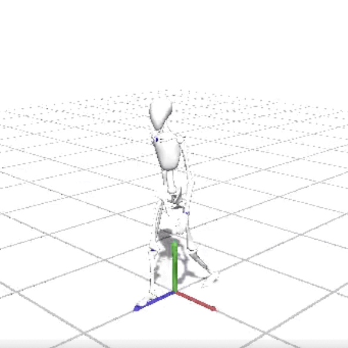
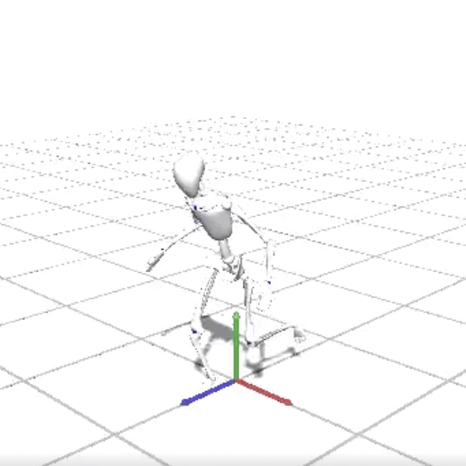
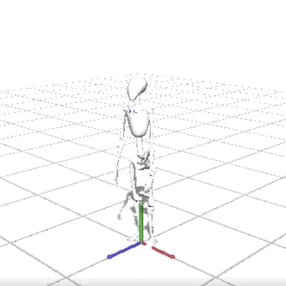
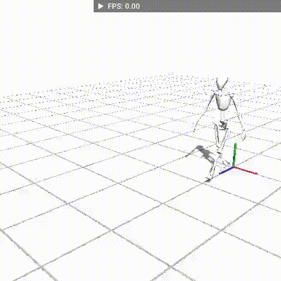
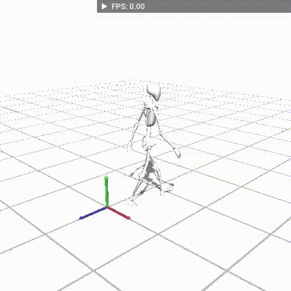
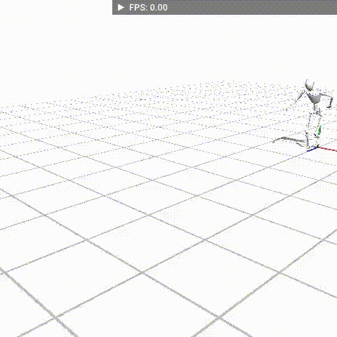
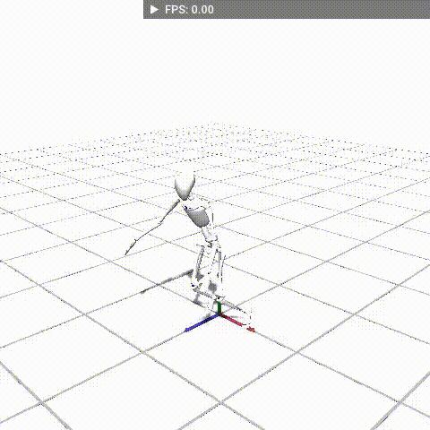

# Leveraging Motion Imitation in Reinforcement Learning for Biped Character

## Branches
Visualizing reference motion: demo
Train Single Motion with Mass curriculum: mass_curriculum
Train Single Motion without Mass curriculum: single_motion
Train One Policy for Multiple Motions with Skill Selector: skill_selector
Train Walking with Random Velocity and Heading: velocity_goal

## Installation
please clone a branch and follow the provided instruction [HOWTO](HOWTO.md) to set up the workflow.

## Demos
### Retargetting from Deepmimic to Bob

Reference - Walking

Reference - Running

Reference - Jumping

Reference - Punching

Reference - Backflip

### Training Results: One Policy per Motion

Training Results - Walk

Training Results - Walk with Random Velocity and Heading

Training Results - Run

Training Results - Jump
